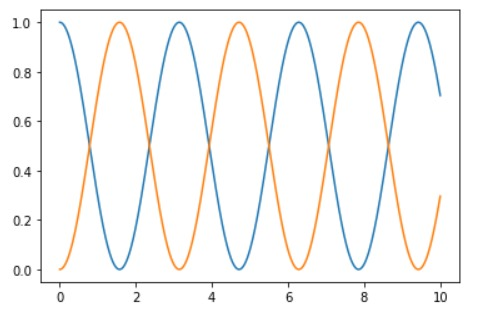

#Tutorial

A continuación se presenta un ejemplo de implementación del método RK4 para resolver un problema dinámico.


```python
#Se importan las librerías necesarias para la ejecución
import numpy as np
import matplotlib.pyplot as plt

Función para la evolución temporal (ver referencia)
def dyn_generator(oper, state):
    return -1.0j*(np.dot(oper,state)-np.dot(state,oper))

#Función para implementar RK4 (ver referencia)
def rk4(func, oper, state, h):
    k_1 = h*func(oper,state)
    k_2 = h*func(oper,state+((k_1)/2))
    k_3 = h*func(oper,state+((k_2)/2))
    k_4 = h*func(oper,state+k_3)
    return state + (k_1 + 2*k_2 + 2*k_3 + k_4)*(1/6)

#Se define el operador lineal 
oOper = np.array([[0, 1], [1, 0]])

#Se establece un estado inicial para el sistema
yInit = np.array([[1, 0], [0, 0]])

#Se define un rango para el tiempo de variación del estado que determina el espaciamiento temporal
tFinal = 10.0
times = np.linspace(0,tFinal,10000)
h = times[1]-times[0]

#Se definen dos arreglos para almacenar el cambio de estado del sistema.
stateQuant00 = np.zeros(times.size)
stateQuant11 = np.zeros(times.size)

#Se elabora un ciclo para guardar el cambio de estado a través de dyn_generator estimado por RK4
for t in range(times.size):
    stateQuant00[t] = yInit[0, 0].real
    stateQuant11[t] = yInit[1, 1].real
    yN = rk4(dyn_generator, oOper, yInit, h)
    yInit = yN

#Por último se grafican los cambios en el estado en funcion del tiempo
plt.plot(times, stateQuant00)
plt.plot(times, stateQuant11)
plt.xlabel('Tiempo')
plt.ylabl('Estado')
plt.show
```



